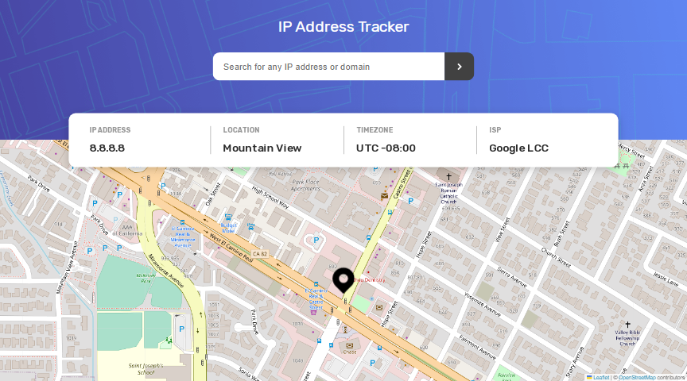

# Frontend Mentor - IP address tracker solution

This is a solution to the [IP address tracker challenge on Frontend Mentor](https://www.frontendmentor.io/challenges/ip-address-tracker-I8-0yYAH0). Frontend Mentor challenges help you improve your coding skills by building realistic projects.

## Table of contents

- [Overview](#overview)
  - [The challenge](#the-challenge)
  - [Screenshot](#screenshot)
  - [Links](#links)
- [My process](#my-process)
  - [Built with](#built-with)
  - [What I learned](#what-i-learned)
- [Author](#author)

**Note: Delete this note and update the table of contents based on what sections you keep.**

## Overview

### The challenge

Users should be able to:

- View the optimal layout for each page depending on their device's screen size
- See hover states for all interactive elements on the page
- See their own IP address on the map on the initial page load
- Search for any IP addresses or domains and see the key information and location

### Screenshot



### Links

- Solution URL: [Add solution URL here](https://your-solution-url.com)
- Live Site URL: [Add live site URL here](https://your-live-site-url.com)

## My process

### Built with

- Semantic HTML5 markup
- CSS custom properties
- Flexbox
- CSS Grid
- Mobile-first workflow
- [React](https://reactjs.org/) - JS library
- [Next.js](https://nextjs.org/) - React framework
- [Leaflet](https://leafletjs.com/) - For building map
- [Ipify](https://geo.ipify.org/) - For getting ip geolocation

### What I learned

Create a custom marker on a leaflet map:

```js
import L from "leaflet";

export const iconMarker = new L.Icon({
  iconUrl: "/images/icon-location.svg",
  iconRetinaUrl: "/images/icon-location.svg",
  iconAnchor: null,
  popupAnchor: null,
  shadowUrl: null,
  shadowSize: null,
  shadowAnchor: null,
  iconSize: [46, 56],
  iconAnchor: [23, 56],
});
```

```js
import {iconMarker} from "./icon";

<Marker position={[position.lat, position.lng]} icon={iconMarker}>
  <Popup>
    A pretty CSS3 popup. <br /> Easily customizable.
  </Popup>
</Marker>;
```

Pass an object as child to a React element :

```js
<AlertBox isOpen={error.state} onClick={closeAlertBox}>
  {[error.message].map((message) => "" + message)}
</AlertBox>
```

## Author

- Website - [OnlyManu](https://onlymanu.vercel.app)
- Frontend Mentor - [@OnlyManu](https://www.frontendmentor.io/profile/OnlyManu)
